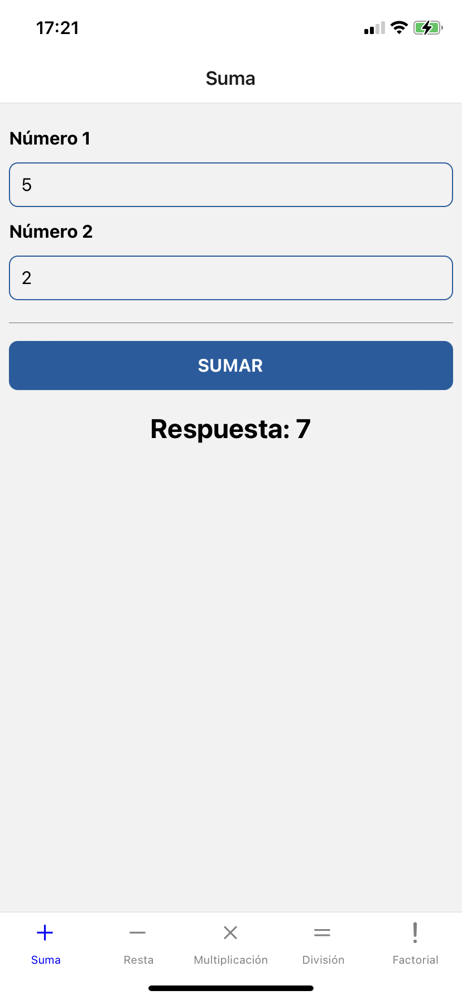
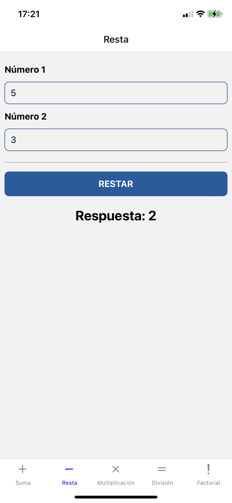
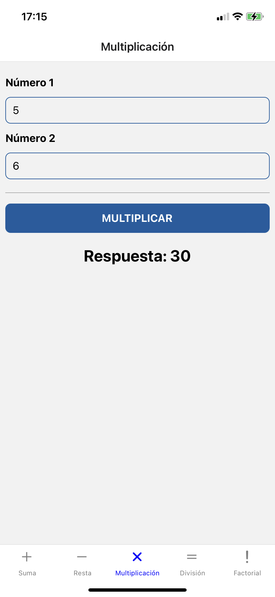
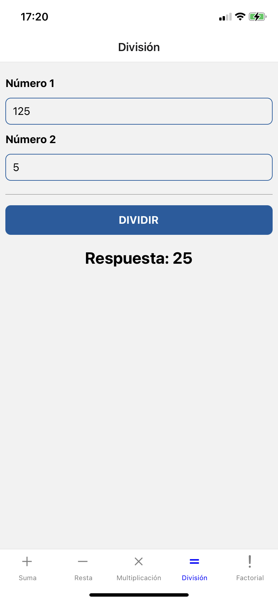
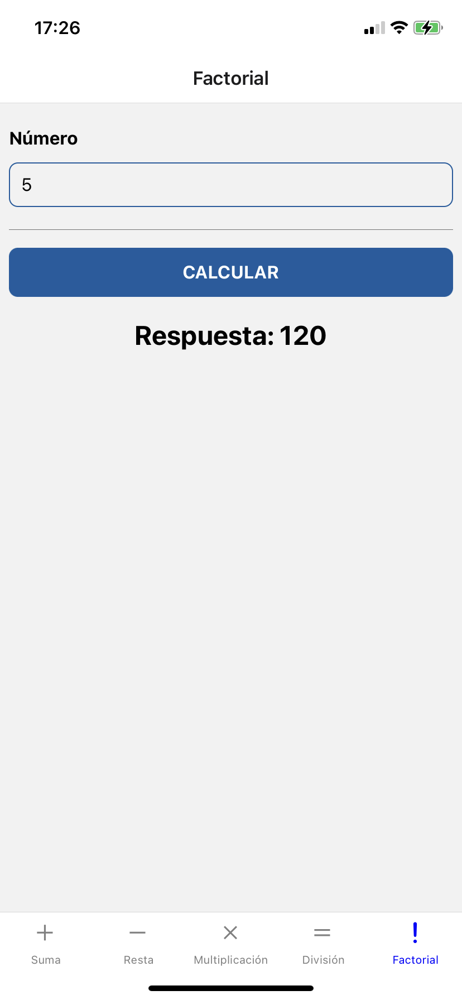

# DPS_Desafio2

##### Nombre

###### Leonardo Elenilson López Cañas

##### Carnet

###### LC171998

##### Laboratorio

###### DPSG04L

#### Suma de dos números

#### Resta de dos números

#### Multiplicación de dos números

#### División de dos números

#### Factorial de un número

